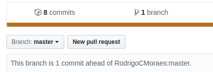

# Meu Primeiro PR

Nunca fez um Pull Request? Comece por aqui!

Neste repositório, você pode testar como fazer um _PR_ por adicionar seu nome no arquivo `nomes.txt`. Lembrando que alterações aqui **não** contarão para o Hacktoberfest.

## Fazendo o (P)ull (R)equest

### 1. Fork

Começe por dar um _fork_ neste repositório.

> Um _fork_ é uma cópia de um repositório. O _Fork_ de um repositório lhe permite experimentar modificações livremente sem afetar o projeto original.

Agora você possui uma cópia deste repositório em seu próprio GitHub!

### 2. Configurando o Git

[Baixe a última versão do Git](https://git-scm.com/downloads)

Agora, abra o terminal ou o Git Bash, caso esteja no Windows e utilize os seguintes comandos pra configurar seu git

Primeiro, defina seu nome de usuário:

> `git config --global user.name "wdsrocha"`

Depois, defina seu e-mail de _commits_:

> `git config --global user.email "wesleysr1997@gmail.com"`

Por último, defina seu e-mail principal pelo GitHub:

Acesse as [configurações de e-mail no seu perfil](https://github.com/settings/emails) e defina seu e-mail primário, caso não tenha um.

### 3. _Clonando_ o _fork_!

Para poder trabalhar no projeto à partir do seu computador, é necessário _clonar_ o _fork_ que foi feito.

Abra o terminal, escolha uma pasta e _rode_

> `git clone https://github.com/{seu_username}/meu-primeiro-pr`

Agora só falta entrar na pasta do repositório

> `cd meu-primeiro-pr`

### 3. Realizando altearações

Adicione seu nome completo no arquivo `nomes.txt` com seu editor de preferência e _commite_ a alteração.

No terminal, adicione suas mudanças

> `git add .`

realize o _Commit_

> `git commit -m "Adicionando o nome Wesley"`

e atualize o repositório remoto

> `git push origin master`

### 4. Criando o _Pull Request_

Agora que as alterações já estão no seu repositório do GitHub, você pode selecionar a opção de "New pull request"

Na página seguinte, você pode descrever o motivo do seu PR. Como este é um repositório de teste, fique à vontade para deixar uma mensagem qualquer ou a mensagem _default_.

## Referências

- https://help.github.com/en/articles/fork-a-repo
- https://guides.github.com/activities/forking/